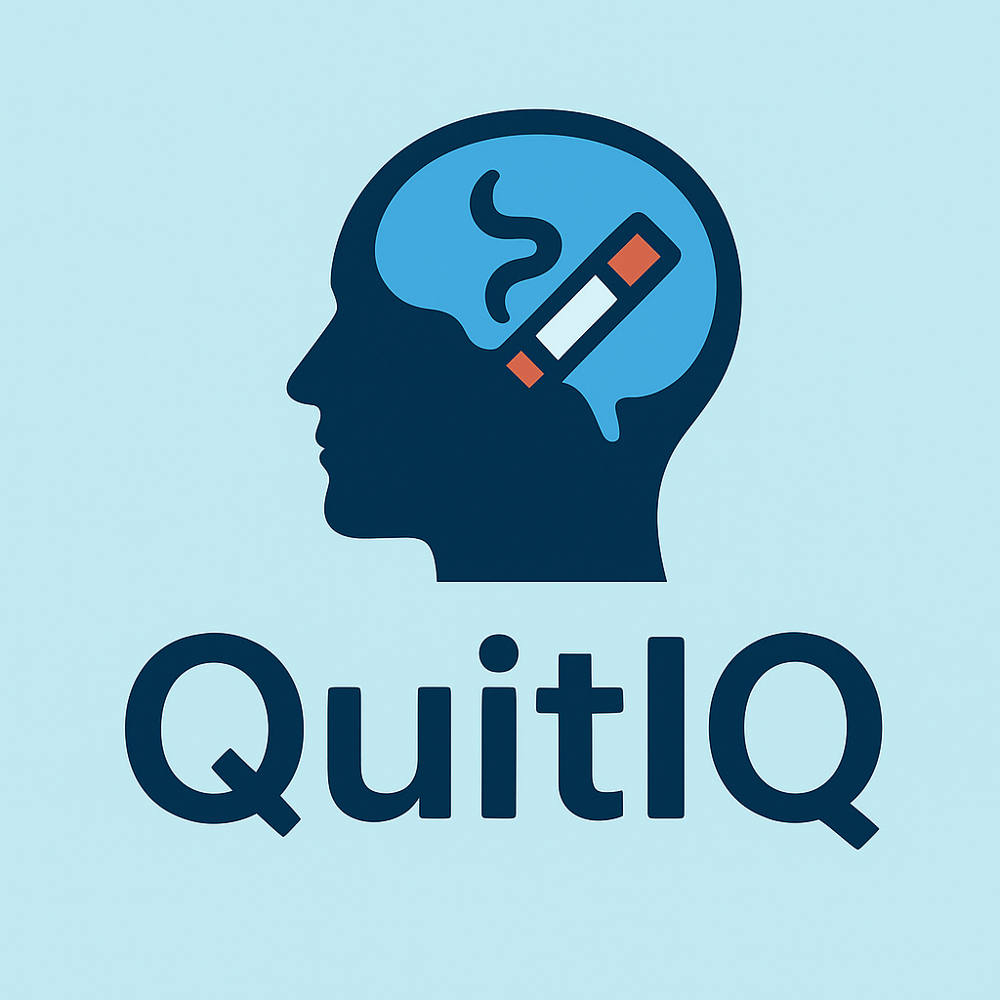

# QuitIQ 🚭

**QuitIQ** is a mobile app built with **Expo (React Native)** to help users quit smoking through motivation, tracking, and support features. It aims to provide smart insights and habit-breaking tools to support users on their journey to quit for good.

---

## 📱 Features

- ✅ Personalized quit plan
- 🧠 Daily motivational tips
- 📊 Stats tracking (money saved, days smoke-free)
- ⏱️ Craving timer and distraction tools
- 🎯 Milestone achievements
- 📝 Journal & mood logging
- 🔔 Smart reminders and push notifications

---

## 🛠️ Tech Stack

- **React Native** (Expo SDK 53)
- **JavaScript / TypeScript**
- **Firebase** (Auth, Firestore, Notifications)
- **Expo Notifications**
- **React Navigation**

---

## 🚀 Getting Started

### Prerequisites

- Node.js 18+
- npm or yarn
- Expo CLI

### Installation

```bash
git clone https://github.com/your-username/quit-iq.git
cd quit-iq
npm install
npx expo start
```
